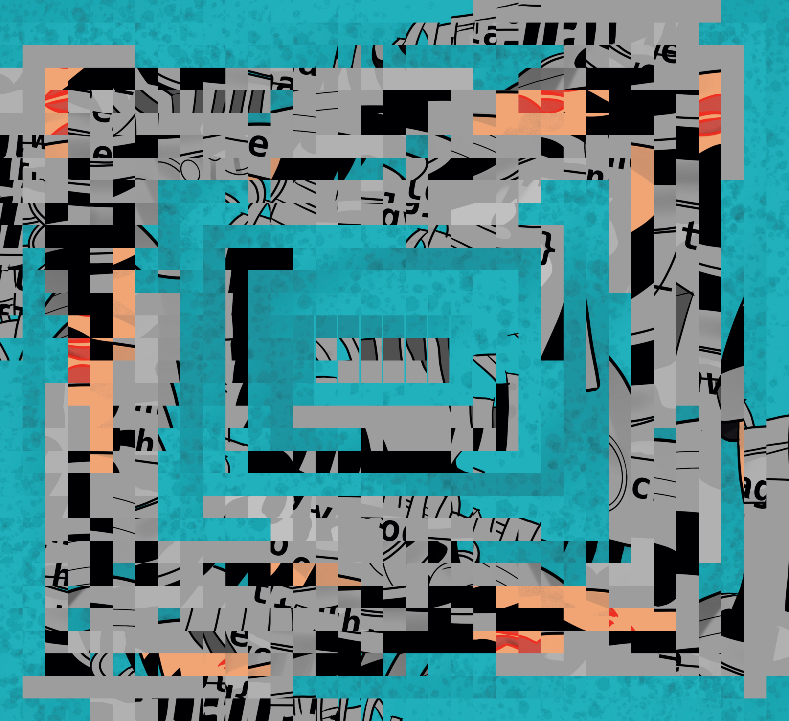

# Poor Murphy

## Description:

Looks like poor Murphy got blasted and all scrambled up. Can you rebuild him?

## Target:



## Difficulty/Points:

100 pt

## Flag:

`flag{we_have_the_technology}`

# Solution

As we can see, the challenge asks us to “unscramble” the given image in order to read the flag. Understood this, we can divide the work into two parts:

1. Get the little squares
2. Order them in a reasonable way

### Point 1: Split the image

To split the image we can use the PIL library for python which contains some useful methods to deal with images. Among these we may find interesting the `crop` method. This requires 4 parameters: the left, the upper, the right and the bottom pixel coordinates). To know how many pixels are there in an image we can make use of the command `exiftool scramble.png`:

```python
Image Width                     : 3500
Image Height                    : 3200
```

On top of that, by counting (or just by looking at the numbers above) we figure out that the number of squares is 35 x 32 (where 35 is the width and 32 is the height): each square is 100 pixels wide. Here’s an idea of how we can get the blocks:

```python
from PIL import Image

iname = "scrambled.png"
img = Image.open(iname)

n,m = (32,35)
size = 100

for i, j in spiral(n,m):
	block = img.crop((j*size, i*size, (j+1) * size, (i+1) * size))
```

### Point 2: Order the image

By looking at the various squares, we find that there is a pattern… indeed, at the lower rows it seems like the square on the left should go on the one on the right. Similarly, the squares on the left columns perfectly fit if they are moved above the one on their top.  Thus, we are in front of a spiral pattern. Here’s a function to describe its positions:

```python
def spiral(m, n):
    k = 0
    l = 0
    while (k < m and l < n):
        for i in range(l, n):
            yield (k,i)
        k += 1
        for i in range(k, m):
            yield (i,n - 1)
        n -= 1
        if (k < m):
            for i in range(n - 1, (l - 1), -1):
                yield (m - 1,i)
            m -= 1
        if (l < n):
            for i in range(m - 1, k - 1, -1):
                yield (i,l)
            l += 1
```

### Final program

So, now we can just sum everything up and create a new image in which append the squares in the right position (following the spiral): 

```python
from PIL import Image

iname = "scrambled.png"

img = Image.open(iname)
tmp = Image.new('RGB', (3500, 3200))
n,m = (32,35)
size = 100

def spiral(m, n):
    k = 0
    l = 0
    while (k < m and l < n):
        for i in range(l, n):
            yield (k,i)
        k += 1
        for i in range(k, m):
            yield (i,n - 1)
        n -= 1
        if (k < m):
            for i in range(n - 1, (l - 1), -1):
                yield (m - 1,i)
            m -= 1
        if (l < n):
            for i in range(m - 1, k - 1, -1):
                yield (i,l)
            l += 1

col, row = (0,0)
for i, j in spiral(n,m):
    block = img.crop((j*size, i*size, (j+1) * size, (i+1) * size))
    Image.Image.paste(tmp, block, (col*size, row*size))
    row += 1
    if row == n:
        row = 0
        col += 1

tmp.save("solved.png", "PNG")
```